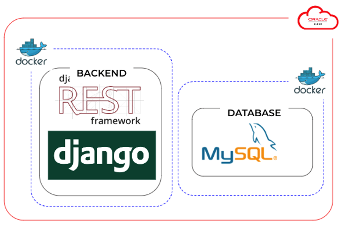

# NCTE
### Note Cursive To E-note  
#### (for Korean Handwritten Notes)  
Upload pictures of handwritten notes and get results of converted text.  
With this Android/ios Application, users can manage handwritten notes online.  

## 1. Usage Example  

  

## 2. Architecture  
### System Architecture  
  

### Oracle Cloud  
  

### AI Architecture  
  

## 3. Installation Process  
```bash
$ git clone https://github.com/2022-AI-FullStack-Internship-TeamB/NCTE.git
$ docker-compose up --build
```  

## 4. Acknowledgement and References  
This project is based on several open-source repositories.  
We used [EasyOCR](https://github.com/JaidedAI/EasyOCR) for detecting and recognizing text. We fine-tuned EasyOCR with training script and pretrained model provided in the link. Dataset we used when fine tuning is part of the data from ai hub - [Korean OCR](https://www.aihub.or.kr/aihubdata/data/view.do?currMenu=115&topMenu=100&aihubDataSe=realm&dataSetSn=91).


## 5. Copyrights / End User Licensce
This project is not intended for commercial use, please do not use it for commercial purposes.  

## 6. Contact Information  
|Name|곽미래|곽서진|고은서|이정현|최정민
|------|---|---|---|---|---|
|Role|backend/DevOps|frontend|frontend|backend/AI|AI|
|Github|@miraekwak|@SJ-Kwak|@godori1012|@Jeong-Hyeon-Lee|@JAIBC|
