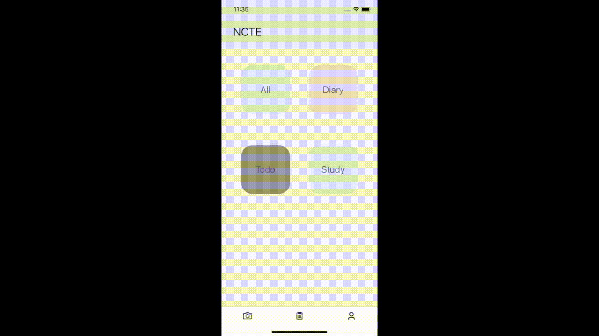
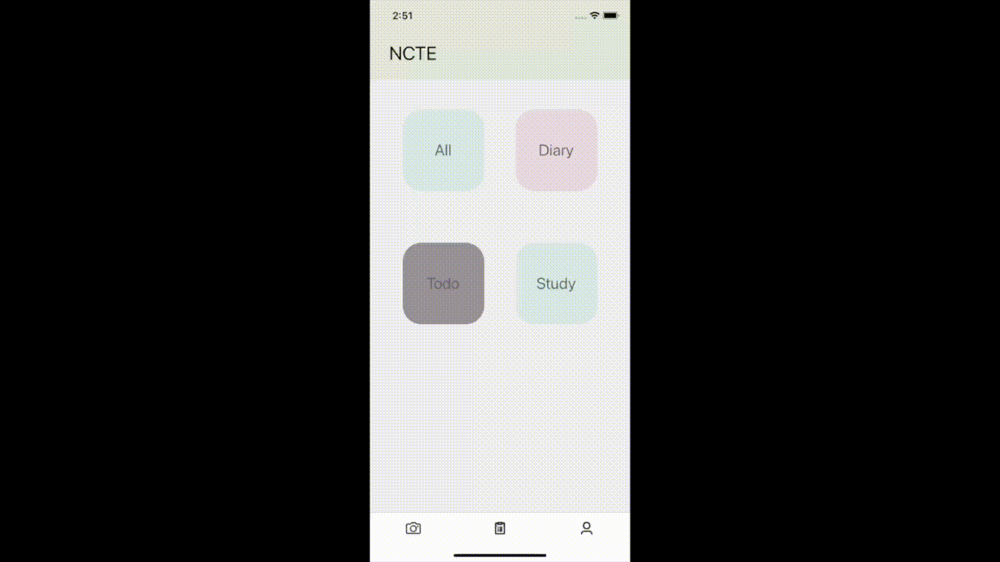
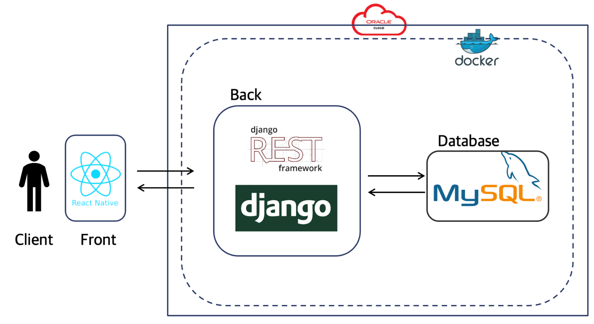
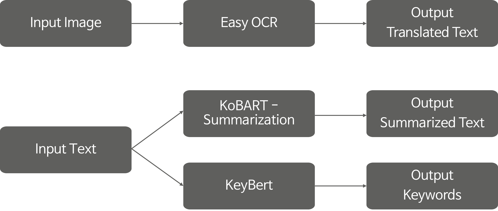

# NCTE
### Note Cursive To E-note  
#### (for Korean Handwritten Notes)  
Upload pictures of handwritten notes and get results of converted text.  
With this Android/ios Application, users can manage handwritten notes online.  

## 1. Usage Example  
 
  

## 2. Architecture  
### System Architecture  
  

### AI Architecture  
  

## 3. Installation Process  
```bash
$ git clone https://github.com/2022-AI-FullStack-Internship-TeamB/NCTE.git
$ docker-compose up --build
```  

## 4. Acknowledgement and References  
This project is based on several open-source repositories.  
We used [EasyOCR](https://github.com/JaidedAI/EasyOCR) for detecting and recognizing text. We fine-tuned EasyOCR with training script and pretrained model provided in the link.  
Dataset we used for fine tuning is part of [Korean OCR data](https://www.aihub.or.kr/aihubdata/data/view.do?currMenu=115&topMenu=100&aihubDataSe=realm&dataSetSn=91) from AI hub.  
We used the [KoBART](https://github.com/SKT-AI/KoBART) model for content summarization. One of the examples provided by kobart, [kobart-sumarization](https://github.com/seujung/KoBART-summarization), was referenced. It is summarized using a pretrained model of kobart-sumarization.
KeyBERT was also used to extract keywords. [Sentence Transformers](https://github.com/UKPLab/sentence-transformers), a package for SBERT, and [KoNLPy](https://github.com/konlpy/konlpy), a morpheme analyzer, were used.

## 5. Copyrights / End User Licensce
This project is not intended for commercial use, please do not use it for commercial purposes.  

## 6. Contact Information  
|Name|곽미래|곽서진|고은서|이정현|최정민
|------|---|---|---|---|---|
|Role|backend/DevOps|frontend|frontend|backend/AI|AI|
|Github|[@miraekwak](https://github.com/miraekwak)|[@SJ-Kwak](https://github.com/SJ-Kwak)|[@godori1012](https://github.com/godori1012)|[@Jeong-Hyeon-Lee](https://github.com/Jeong-Hyeon-Lee)|[@JAIBC](https://github.com/JAIBC)|
